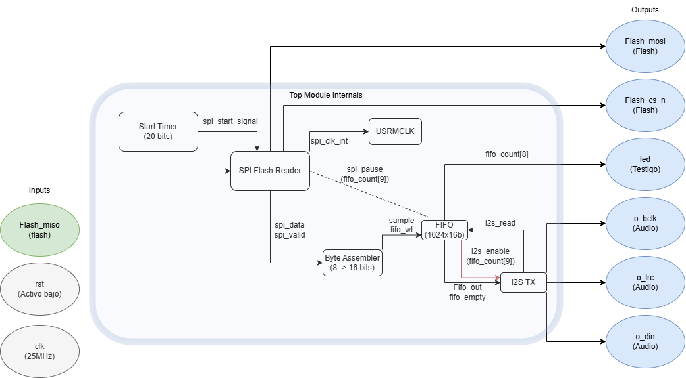
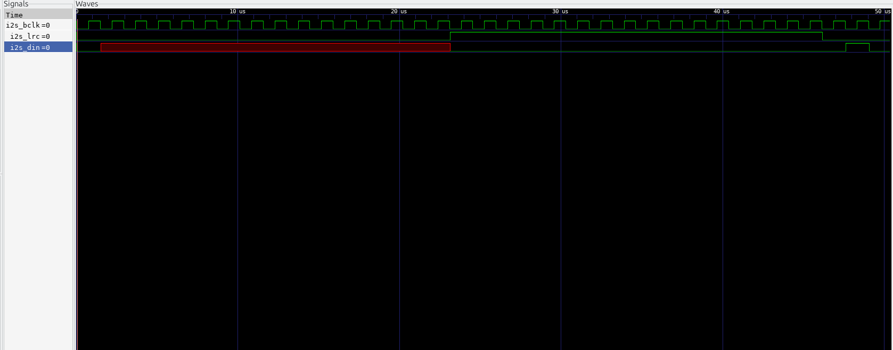

# Reproductor de Audio Digital (I2S + SPI Flash) en FPGA

Este proyecto implementa un sistema capaz de reproducir audio digital **mono** de 16 bits a **22.05 kHz**, utilizando una memoria **SPI Flash** como fuente de datos y un **DAC MAX98357A** como salida de audio mediante el protocolo **I2S**.

**Plataforma:** FPGA Colorlight 5A-75E (Lattice ECP5)  
**Lenguaje:** Verilog HDL  
**Herramientas:** Yosys, Nextpnr, OpenFPGALoader, GTKWave  

---

## Arquitectura del Sistema

El diseño se desarrolló con una estructura modular para facilitar la depuración y mantener la estabilidad de las señales. Se separó la lógica de control del flujo de datos para evitar interferencias entre ambos procesos.

### Diagrama General



*(Fig. 3 – Estructura general del sistema de reproducción de audio)*

### Flujo Simplificado
`SPI Flash` → **[Lector SPI]** → **[Ensamblador de Bytes]** → **[FIFO]** → **[Transmisor I2S]** → `DAC`

### Descripción de los módulos

1. **Lector SPI (`spi_flash_reader`):** Controla la lectura de la memoria Flash W25Qxx mediante una FSM que envía el comando `0x03`.  
2. **Ensamblador (`byte_assembler`):** Combina dos bytes consecutivos de 8 bits para formar una muestra de audio de 16 bits (Little Endian).  
3. **FIFO (`fifo_top`):** Actúa como buffer intermedio entre la lectura (rápida y por ráfagas) y la reproducción (constante y lenta).  
4. **Transmisor I2S (`i2s_tx`):** Genera las señales `BCLK` y `LRC` y serializa los datos hacia el DAC.

---

## Cambios y Ajustes Técnicos

Durante la etapa de pruebas se detectaron algunos problemas de hardware que llevaron a realizar varias mejoras en el diseño final:

### 1. Temporizador de arranque
**Problema:** Al encender la FPGA se escuchaba un ruido fuerte o estática.  
**Causa:** La memoria Flash aún no estaba lista cuando la FPGA intentaba leerla.  
**Solución:** Se agregó un temporizador de **40 ms** en `top.v` que mantiene el sistema en espera antes de activar el `Chip Select`. Con esto, el ruido desapareció y la lectura se volvió estable.

### 2. Separación de control y flujo de datos
Se dividieron los módulos complejos (SPI e I2S) en dos archivos: `_control.v` (FSM) y `_datapath.v` (registros y contadores).  
Esto permitió analizar los tiempos de reloj del datapath de forma independiente, logrando un `BCLK` limpio y sin glitches.

### 3. Sincronización matemática del I2S
Se reemplazó la generación del reloj por estados por un contador exacto (`LIMIT = 18`), calculado a partir del reloj base de 25 MHz:

> 25 MHz / (22 050 Hz × 32 bits × 2 canales) ≈ 17.7 → redondeado a 18 ciclos.

---

## Simulación y Verificación

Se realizaron simulaciones funcionales con `make sim` para verificar el comportamiento del sistema antes de la síntesis.

### Configuración de simulación
El archivo **`sim/vista_final.gtkw`** organiza las señales por colores y módulos. Puede abrirse directamente en **GTKWave**.

### 1. Inicio de transmisión (SPI)
La siguiente captura muestra el **temporizador de 40 ms**, durante el cual `cs_n` se mantiene alto hasta que la Flash está lista:

  
*(Fig. 1 – Activación de la lectura después del retardo de arranque)*

### 2. Protocolo I2S
Se comprobó que por cada ciclo de `i2s_lrc` (selección de canal) se generan **32 ciclos de `i2s_bclk`**, cumpliendo el estándar I2S. Los datos (`i2s_din`) cambian en el flanco descendente de `BCLK`.

  
*(Fig. 2 – Generación de relojes y transmisión de datos al DAC)*

---

## Conversión del Audio (`ffmpeg`)

El sistema requiere un archivo binario crudo (raw binary) con el siguiente formato:  
**PCM 16 bits, mono, 22 050 Hz.**

Si el audio se escucha muy fuerte, se recomienda aplicar un filtro de volumen al convertirlo:

```bash
sudo apt install ffmpeg
ffmpeg -i cancion.mp3 -filter:a "volume=0.6" -f s16le -ac 1 -ar 22050 -acodec pcm_s16le audio.bin
```


El sistema requiere que el archivo de audio esté en formato binario crudo (raw binary) con las siguientes especificaciones exactas: **PCM, 16 bits, Mono y 22050 Hz.**

Si no se aplica el filtro de volumen, el audio digital puede sonar saturado y fuerte en el parlante.

Para convertir un archivo de audio (ej: `cancion.mp3`) al archivo requerido (`audio.bin`), ejecute el siguiente comando en la terminal (requiere tener `ffmpeg` instalado):

```bash
sudo apt install ffmpeg  
ffmpeg -i cancion.mp3 -filter:a "volume=0.6" -f s16le -ac 1 -ar 22050 -acodec pcm_s16le audio.bin

```

 ## 🔌Conexiones (Pinout)


Las conexiones físicas se realizan en el conector J1 de la Colorlight 5A-75E:


| Señal | Pin FPGA | Conexión DAC (MAX98357A) | Descripción |

| :--- | :--- | :--- | :--- |

| **i2s_bclk** | `C4` | **BCLK** | Reloj de Bit |

| **i2s_lrc** | `D4` | **LRC / LRCLK** | Selección de Canal (Word Select) |

| **i2s_din** | `E4` | **DIN** | Entrada de Datos Serial |

| **GND** | `GND` | **GND** | Tierra Común |

| **VCC** | `5V` | **VIN** | Alimentación |


---


##  Instrucciones de Ejecución


Este proyecto está automatizado mediante un `Makefile`.


1.  **Limpieza del proyecto:**

    ```bash

    make clean

    ```


2.  **Síntesis y Generación de Bitstream:**

    ```bash

    make syn

    ```


3.  **Carga del Archivo de Audio:**

    *Importante:* Este comando desbloquea los sectores de la Flash y carga el archivo `audio.bin` en la dirección `0x200000`.

    ```bash

    make load-audio

    ```


4.  **Configuración de la FPGA:**

    ```bash

    make config

    ``` 
## Video final del prototipo funcionando

https://youtu.be/m0pJglNk4Ic?si=bd356dDi5KDWL8jd
